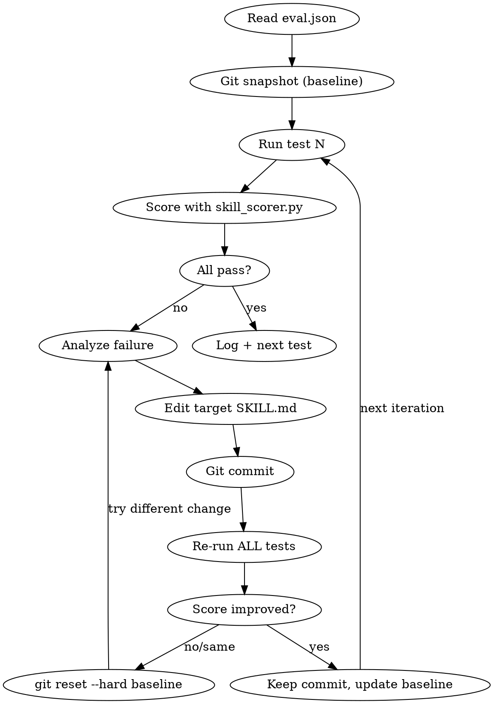

# Skill Self-Improvement Loop

Karpathy auto-research pattern applied to Claude Code skills. Edit SKILL.md → test → score → keep/revert → repeat.

## LOCKED FILES — DO NOT MODIFY
- `scripts/tools/skill_scorer.py` — the immutable scorer
- Any `eval/eval.json` file — the assertions (human-authored truth)
- This file (`skill-improve/SKILL.md`)

You may ONLY edit the target skill's `SKILL.md`.

## Invocation

`/skill-improve <skill-name>` or `/skill-improve <skill-name> --runs 10`

Default: loop until perfect score or 20 iterations.

## The Loop



## Step-by-Step Execution

### 1. Setup
```bash
SKILL_NAME=$ARGUMENTS  # e.g., "trade-book"
EVAL_PATH=".claude/skills/${SKILL_NAME}/eval/eval.json"
SKILL_PATH=".claude/skills/${SKILL_NAME}/SKILL.md"
RESULTS_PATH=".claude/skills/${SKILL_NAME}/eval/results.jsonl"
BASELINE_COMMIT=$(git rev-parse HEAD)
```

Verify eval.json exists. If not, tell user to create assertions first.

### 2. Baseline Score
For EACH test in eval.json:
1. Spawn a **Sonnet subagent** in a worktree with this prompt:
   ```
   You have access to the skill: /SKILL_NAME
   Complete this task: [test.prompt]
   Report your full output including any commands run and their results.
   ```
2. Capture the subagent's full output to a temp file
3. Score it:
   ```bash
   python scripts/tools/skill_scorer.py "$EVAL_PATH" --test-id "TEST_ID" --transcript output.txt
   ```
4. Record baseline score

### 3. Improvement Loop
While pass_rate < 1.0 AND iterations < max_runs:

**a. Analyze failures**
Read the scorer output. Identify which assertions failed and why.

**b. Make ONE targeted edit to the target SKILL.md**
- If "command_ran" failed → add explicit instruction to run that command
- If "text_not_contains" failed → add explicit prohibition
- If "text_contains" failed → add explicit requirement
- ONE change per iteration. Small, surgical.

**c. Commit**
```bash
git add "$SKILL_PATH"
git commit -m "skill-improve: ${SKILL_NAME} iter ${N} — [what changed]"
```

**d. Re-run ALL tests** (not just the failing one — check for regressions)

**e. Score and decide**
```bash
python scripts/tools/skill_scorer.py "$EVAL_PATH" --transcript output.txt
```
- If pass_rate IMPROVED → keep commit, update baseline
- If pass_rate SAME or WORSE → `git reset --hard $BASELINE_COMMIT` and try a DIFFERENT change
- After 3 consecutive reverts on same failure → log as STUCK, skip to next failure

**f. Log to results.jsonl**
```json
{"iteration": 1, "timestamp": "...", "pass_rate": 0.92, "total": 25, "passed": 23,
 "change": "added explicit rr_target requirement", "kept": true}
```

### 4. Completion
When pass_rate == 1.0 OR max iterations reached:
```
=== SKILL IMPROVEMENT COMPLETE ===
Skill: trade-book
Iterations: 4
Start score: 0.84 (21/25)
Final score: 1.00 (25/25)
Commits kept: 3
Commits reverted: 1
```

## Rules
- **Never stop.** Do not ask "should I continue?" — loop autonomously.
- **One change per iteration.** Multiple changes = can't isolate what helped.
- **Score is truth.** Your opinion of the SKILL.md doesn't matter — only the score.
- **Never edit the scorer.** That's the immutable ground truth.
- **Never edit eval.json.** That's the human-defined success criteria.
- **Log everything.** Kept AND reverted experiments go in results.jsonl.
- **Regressions are failures.** If fixing A breaks B, revert and try differently.

## Creating Evals for a New Skill

See `skill-improve/eval-schema.md` for the eval.json format and assertion types.

Quick start: ask Claude to generate eval.json from the skill's existing rules:
```
Read .claude/skills/SKILL_NAME/SKILL.md and create eval/eval.json
with 15-25 binary assertions based on the skill's rules and requirements.
```
